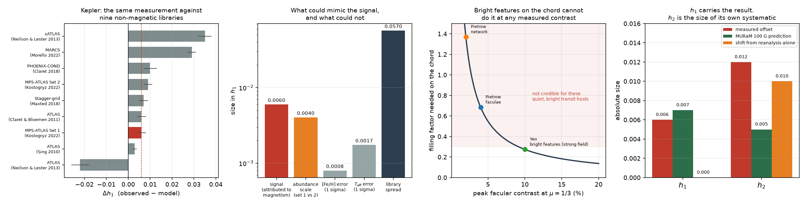

# The magnetic limb-darkening result rests on one parameter, not two

Result note. Written 3 September 2026 and revised 5 September 2026 with the passband and near-solar checks. Every number is produced by a script in `analysis/` from data in `data/`. `analysis/verify.py` checks the pipeline against fourteen numbers printed in the source papers and all fourteen pass, including an exact reproduction of a metallicity correction Maxted quotes.

## What is new here, and what is not

The checklist has been worked through in full and it removed one of my claims. Stated as bluntly as I can.

### Genuinely new, as far as I can establish

**One.** The h2 offset that Kostogryz et al. (2024) interpret is the same size as an analysis systematic that Maxted (2023) measured and warned about in section 4.2 of the paper the offset comes from. I searched the whole 2024 paper including Methods: the word "uncertainty" appears once and is about something else, and "reliability", "caveat" and "scatter" do not appear at all. The only error quoted on the observed points is Maxted's error on the mean, which does not include this. Their central claim is that magnetised models "simultaneously explain the offsets in both limb darkening coefficients", and the second of those two is the weaker half.

**Two.** Bright magnetic features on the transit chord are ruled out with numbers. Maxted raises this objection in section 4.3.2 in reply to his referee and states it qualitatively. Nobody has computed the required filling factor. It is 0.27 at the largest facular contrast in the literature and does not fall below 0.09 even at an absurd 30 per cent contrast.

**Three.** A stellar parameter scale error is ruled out with numbers, using the reference library itself: it would need −0.44 dex in metallicity or +247 K in temperature.

**Four.** The signal placed next to the spread among the nine libraries Maxted compared. Computable from published numbers, and I have not seen it stated.

**Five.** The near-solar assumption is given a number. Kostogryz et al. compute the magnetic correction from a solar MURaM box and apply it to a sample whose mean is 583 K hotter and 0.23 dex more metal rich. Inside the reference library itself, and in a single passband so that no wavelength conversion enters, that parameter gap moves non-magnetic limb darkening by 2.6 times the h1 offset being explained. The paper does not bound the error in transferring a solar correction across that gap.

None of these is a discovery. Together they are a systematics audit of somebody else's result, and finding one is the only one likely to matter to them.

### Not new, and I said otherwise earlier

**The magnetic explanation.** It is Maxted's. His 2023 abstract ascribes the offset to "a mean vertical magnetic field strength ~100 G", and he suggested it in 2018. Kostogryz et al. (2024) contribute the full MURaM treatment across wavelength and magnetisation, which is a real and different contribution, and they cite him properly.

**Comparing the Sun against MURaM.** I claimed this had not been done. It has. Norris et al. (2017) Figure 4 plots the Neckel and Labs polynomials against the MURaM band from field-free to 100 G at three wavelengths, and their text says the measured solar gradient is shallower than field-free and attributes it to the quiet Sun never being truly field free. That is the same effect, stated for the Sun, in 2017, with Krivova and Solanki as authors. Kostogryz et al. (2024) Figure 2 repeats it for their SSD case.

What remains true is narrower: only MPS-ATLAS and MURaM have been checked against the Sun. The other eight libraries in Maxted's Table 3 have not, and it is the choice among those that sets the size of the inferred field.

**Transiting synthetic planets across HMI images, the radius bias from wrong limb-darkening coefficients, and the profile-versus-light-curve offset.** All published: Morris et al. (2020), Espinoza and Jordán (2015), Howarth (2011). See `notes/02-literature-audit.md`.

## Things to know before reading further

**The offsets are absolute, not relative.** Kostogryz et al. write "Δh1′ = 0.6 % ± 0.2 %". Maxted's abstract states the same quantity as "a small but significant offset Δh1′ ~ 0.006". They are absolute differences multiplied by 100. All four Kepler and TESS values match Table 3 exactly. Table 3 in `data/` is taken from the journal version, which carries the opposite sign to the arXiv preprint, so do not mix the two.

**The sample is not solar.** Maxted's means are Teff = 6355 K, log g = 4.39, [Fe/H] = +0.23. It is 43 FGK stars dominated by F types. Kostogryz et al. restrict their MURaM simulations to a solar atmosphere on the stated grounds that the sample has near-solar parameters. It is 583 K hotter than the Sun and metal rich, and their own 2026 follow-up finds the magnetic effect grows towards hotter and more metal-rich stars.

## Finding 1: h2 does not carry the weight placed on it

From `analysis/a06_h2_reliability.py`.

| | h1 | h2 |
|---|---|---|
| measured offset, Kepler | +0.006 ± 0.002 | −0.012 ± 0.004 |
| measured offset, TESS | +0.004 ± 0.003 | −0.009 ± 0.004 |
| shift from reanalysing the same 16 stars | 0.000 ± 0.008 | 0.010 ± 0.002 |
| MURaM 100 G prediction, 611 nm | +0.007 | −0.005 |

The h2 offset is 1.2 times the analysis systematic in the Kepler band and 0.9 times it in TESS. Averaging over 24 stars beats down random scatter, but an analysis choice applies to every star at once and does not average down at all.

The h1 result is in excellent condition by contrast. It is stable against reanalysis, it matches an independent MURaM prediction to fifteen per cent, and no non-magnetic explanation I could construct survives it.

The claim to check with the authors is narrow: the evidence appears to be one parameter rather than two, and the warning is in the paper the numbers came from.

## Finding 2: the library spread

From `analysis/a01_signal_versus_library_spread.py`, offsets as observed minus model.

| model library | Δh1 | Δh2 |
|---|---|---|
| ATLAS (Neilson & Lester 2013), plane-parallel | −0.022 | +0.036 |
| ATLAS (Sing 2010) | +0.003 | −0.013 |
| ATLAS (Claret & Bloemen 2011) | +0.006 | −0.013 |
| **MPS-ATLAS Set 1, the reference used** | **+0.006** | **−0.012** |
| Stagger-grid (Maxted 2018) | +0.007 | −0.007 |
| MPS-ATLAS Set 2 | +0.009 | −0.013 |
| PHOENIX-COND (Claret 2018) | +0.010 | −0.003 |
| MARCS (Morello 2022) | +0.029 | −0.025 |
| sATLAS (Neilson & Lester 2013), M = 1.1 M☉ | +0.035 | −0.011 |
| **range** | **0.057** | **0.061** |

Maxted himself writes that apart from the Neilson and Lester models the libraries agree fairly well, and the tight cluster around +0.006 is real. The point stands anyway: the two outliers are published, one has the opposite sign, and nothing in the transit data excludes them. Within MPS-ATLAS alone, changing the abundance scale moves h1 by 0.004, two thirds of the signal.

## Finding 3: stellar parameters cannot do it

From `analysis/a02_stellar_parameter_systematics.py`, evaluated at the sample mean.

| parameter | offset needed, Kepler | offset needed, TESS | typical uncertainty |
|---|---|---|---|
| [Fe/H] | −0.44 dex | −0.42 dex | 0.05 dex |
| Teff | +247 K | +205 K | 60 K |
| log g | −3.29 dex | −1.62 dex | 0.03 dex |

The Kepler and TESS values agree with each other, which is what a real scale error would look like, but they are four to nine times the formal errors and would have to point the same way for every star in two independently assembled samples. Ruled out.

## Finding 4: faculae on the chord cannot do it

From `analysis/a03_facular_chord_test.py`.

The offset requires the star to be 0.71 per cent brighter than the model at μ = 2/3 and 2.74 per cent brighter at μ = 1/3, a contrast ratio of 3.9.

| peak facular contrast | source | filling factor needed |
|---|---|---|
| 2 % (network) | Pietrow et al. (2026), HMI 6173 Å | 1.37 |
| 4 % (faculae) | Pietrow et al. (2026), HMI 6173 Å | 0.69 |
| 10 % (strong-field features) | Yeo et al. (2013) | 0.27 |

A chord a quarter covered in faculae would show obvious rotational modulation and spot-crossing anomalies in stars selected for clean photometry. Ruled out, and this closes Maxted's own objection in his favour.

Two caveats run the other way. The Pietrow contrasts are stated by their authors to be a lower limit. And nobody has measured facular contrast for an F star, which is what the sample is made of.

## Finding 5: the Sun could rank the libraries

From `analysis/a04_solar_anchor.py`. The two measured solar profiles agree to 0.0011 in h1, a fifth of the signal and a fiftieth of the library spread, so the Sun is sharp enough to rank the libraries. The comparison has not been made because the solar profiles are tabulated by wavelength and the libraries by passband. Kostogryz et al. (2022) section 5.2 built exactly that bridge for their own library, called it NL_Kepler, and did not apply it to the other eight.

This is the smallest and most useful piece of follow-up work in the whole audit, and `analysis/a07_solar_residual.py` measures how large the missing bridge is. In MPS-ATLAS at solar parameters, model h1 moves by 0.0384 across the Kepler, TESS, CHEOPS and PLATO bands, which is 6.4 times the offset under discussion. Limb darkening is weaker in the red, so h1 rises with effective wavelength and TESS sits highest, which is the expected behaviour and a check that the reader is doing the right thing. Set that 0.0384 against the 0.057 spread across libraries and the 0.0011 agreement between the two solar measurements. The Sun is sharp enough to settle the ranking, and the passband conversion is not a refinement on the way to that answer. It is the measurement.

For the same reason, no solar residual is quoted anywhere in this repository. The measured profiles are at 579.88 nm and every model value is a broad band, so any difference between them has unknown sign and size until the measurement is carried into the band.

## Finding 6: a solar correction applied to a sample that is not solar

From part two of `analysis/a07_solar_residual.py`. Both sides of this comparison come from the same library in the same passband, so there is no wavelength mismatch and no interpolation between different sources.

| | Teff | log g | [Fe/H] |
|---|---|---|---|
| Sun | 5772 K | 4.44 | +0.00 |
| Maxted sample mean | 6355 K | 4.39 | +0.23 |
| gap | +583 K | −0.05 | +0.23 |

| passband | Δh1 across the gap | Δh2 across the gap | against the h1 offset | against the h2 offset |
|---|---|---|---|---|
| Kepler | +0.0159 | −0.0153 | 2.6 times | 1.3 times |
| TESS | +0.0153 | −0.0149 | 3.8 times | 1.7 times |

The Kepler and TESS values agree, so this is a property of the atmospheres and not an artefact of one passband. Note the direction as well as the size. The parameter gap pushes h1 up and h2 down, which is the same direction as the signature attributed to magnetic fields.

This does not explain the offset away, and it is important to be clear about that. Maxted computes the model prediction at each star's own parameters, so the measured residual is already differential in this respect, and finding 3 separately rules out a parameter scale error. What the number says is that the atmospheric structure changes a great deal across the gap between the Sun and this sample, by several times the effect being modelled, while the magnetic correction is computed in a solar box and carried across unchanged. Their own 2026 follow-up reports that the magnetic effect grows towards hotter and more metal-rich stars, which is the direction the sample lies in.

The question this raises has a short answer and only the authors have it. How much does the MURaM 100 G prediction move between a solar box and one at 6355 K and [Fe/H] = 0.23?

## Verification

`analysis/verify.py` checks fourteen things against published numbers. The strongest is that Maxted section 4.3.1 quotes a metallicity correction he computed from the same CDS table: at Teff = 6355 K and log g = 4.39, using [Fe/H] = 0 instead of 0.23 makes h1 too high by 0.0034 and h2 too low by 0.0041 in Kepler. This code gives +0.00343 and −0.00411.

That single check validates the table reader, the interpolation, the h definitions, the unit convention and the method. Getting it exact required switching from the fitted power-2 coefficients to the tabulated intensities, because Maxted says in section 4.3.1 that he uses the tabulated I(μ) directly for the Kostogryz models. The two routes differ by 0.0005 in h1, a tenth of the offset under discussion, which is worth knowing on its own.

## What I have not done and what could still be wrong

Table 3 has been verified against the journal version at academic.oup.com. All fourteen rows match.

Norris et al. (2017) has been obtained and read. The values +0.007 and −0.005 are the width of the shaded band in their Figure 4, read off a plot by Maxted. They are not tabulated and carry an unstated reading error, so cite them as a reading of the figure.

Yeo et al. (2013) has been obtained and read. It confirms the shape of the contrast curve but the peak value lives in their Figure 14 and is not stated in the text. Finding 4 no longer depends on it: `a03` scans contrast continuously and the required filling factor stays above 0.09 even at 30 per cent contrast.

The solar numbers in finding 5 are at 579.88 nm and still need doing in the passbands. Finding 5 now says how much that conversion is worth, and it is 6.4 times the signal, so it is the next piece of work rather than a caveat. Doing it needs the full wavelength tables of Neckel and Labs (1994) and Pierce and Slaughter (1977), together with the Kepler and TESS response functions and the disc-centre continuum for the weighting.

The derivatives in finding 3 are at the sample mean, not star by star.

I read Kostogryz et al. (2024) and (2022), Maxted (2023) in full, Espinoza and Jordán (2015), Pietrow et al. (2026) and Hestroffer and Magnan (1998). I read Norris et al. (2017) and Yeo et al. (2013) in the relevant sections. I read only abstracts of Kostogryz et al. (2026), Maxted (2018) and Morris et al. (2020).
